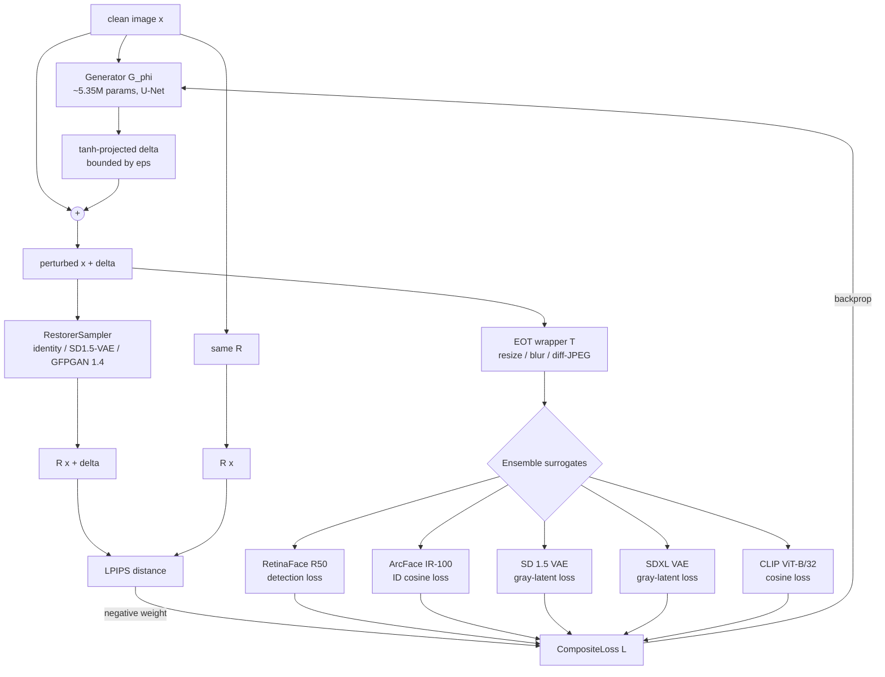
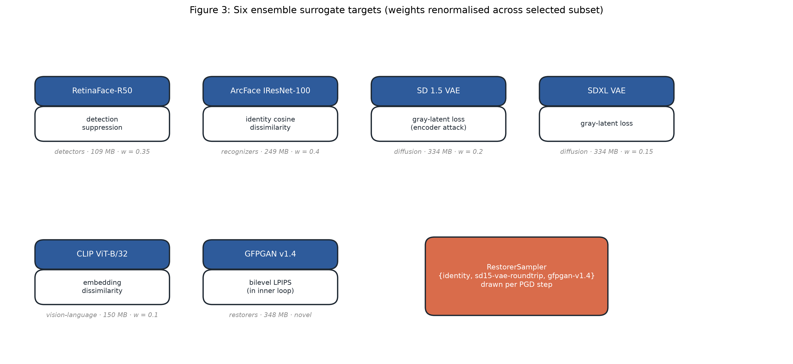
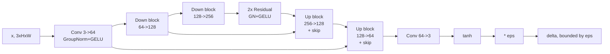

# Voidface: A Bilevel Adversarial Perturbation Framework for Face-Swap Defense

**Jakub Zítko**, independent researcher, Czechia  
Repository: <https://github.com/JakubZitko/voidface>

*Version 0.1 draft, 2026-07-06. MIT-licensed.*

---

## Abstract

Non-consensual intimate imagery (NCII) generated by face-swap and identity-preserving diffusion pipelines has become a first-order online harm: the UK Revenge Porn Helpline logged 22,275 reports in 2024 [SWGfL, 2024], NCMEC's CyberTipline saw AI-related reports rise from roughly 4,700 to 67,000 in a single year [NCMEC, 2024], and the Internet Watch Foundation reported a 260-fold year-over-year jump in AI-generated CSAM video [IWF, 2025]. Reactive systems (StopNCII.org, NCMEC Take It Down) are hash-lookup and fire only after an image already exists; existing proactive cloaks (Fawkes, PhotoGuard, Glaze, Mist, Anti-DreamBooth, MetaCloak) are stripped by simple purification pipelines that include a face restorer such as GFPGAN [Honig et al., 2025; Pleimling et al., 2026]. We present voidface, an MIT-licensed, offline-first, on-device pre-upload defense whose novel contributions are (i) a bilevel training loop that inserts a real GFPGAN inner step so perturbations survive restoration, (ii) an iris-region L-infinity budget boost, (iii) jointly-optimized sub-pixel semantic warps, and (iv) a ~5.5 MB int8 generator that amortizes PGD into a single forward pass and ships to CoreML, ONNX, and browsers. Training and evaluation infrastructure are complete and open; a full-scale training run (R5.5) remains the ship-blocker.

---

## Table of Contents

1. [Introduction](#1-introduction)
2. [Threat Model](#2-threat-model)
3. [Related Work](#3-related-work)
4. [Method](#4-method)
5. [Evaluation Methodology and Current State](#5-evaluation-methodology-and-current-state)
6. [Ethics and Dual-Use](#6-ethics-and-dual-use)
7. [Limits](#7-limits)
8. [Roadmap](#8-roadmap)
9. [References](#9-references)
10. [Acknowledgments](#10-acknowledgments-and-open-source-commitment)

---

## 1. Introduction

Face-swap and identity-preserving image-to-image generation have moved from curiosity to industrialized harm in under five years. Sensity's 2019 audit found that 96% of deepfake videos online were pornographic and 100% of the top destinations targeted women [Ajder et al., 2019]; by 2023, Home Security Heroes measured a 464% year-over-year increase in deepfake pornography, with 99% of victims female [Home Security Heroes, 2023]. The UK Revenge Porn Helpline received a record 22,275 intimate-image-abuse reports in 2024, up 20.9% over 2023 [SWGfL, 2024]. In the United States, NCMEC's CyberTipline received roughly 20.5 million reports in 2024, of which AI/generative-AI-related reports surged from ~4,700 in 2023 to ~67,000 in 2024 [NCMEC, 2024]. The Internet Watch Foundation assessed 8,029 AI-generated realistic child-sexual-abuse images in 2025, including 3,443 AI-generated CSAM videos versus 13 in 2024 - a 260-fold increase - and noted that a photorealistic model of a specific child now requires only 20 images and 15 minutes of LoRA fine-tuning [IWF, 2025]. Nudify services amplify the same harm at consumer scale: ClothOff alone reached ~4M monthly visitors by mid-2024, with an estimated ~$36M/year in category-wide revenue [Wikipedia, 2025; CameraForensics, 2025].

The policy response is broad but downstream. In the US, the TAKE IT DOWN Act was signed on 19 May 2025, criminalizing publication of digital-forgery NCII and imposing a 48-hour platform takedown duty that must be operational by May 2026 [117th Congress, 2025]. The UK Online Safety Act 2023 s.66B, in force since 31 January 2024, defines "photograph or film" to include deepfakes; the Data (Use and Access) Act 2025 further criminalizes creation [UK Parliament, 2024, 2025]. The EU AI Act Article 50(4) requires disclosure of deepfake content from 2 August 2026 [European Commission, 2024]. All of these regimes activate after an image has been created and distributed - none physically prevents a face-swap pipeline from producing a convincing output.

Reactive tooling has the same shape. StopNCII.org has generated more than one million victim-controlled hashes across Meta, TikTok, Reddit, Snap, Bing, OnlyFans, Aylo, and others [SWGfL, 2024]; NCMEC's Take It Down provides the analogous service for minors [NCMEC, 2023]. Both are perceptual-hash systems and, by design, only match known images: any AI-generated variation produces new pixels, and the IWF has stated explicitly that "traditional hashing cannot identify AI-generated content because each synthetically created image is technically new" [IWF, 2025]. Content-provenance systems (C2PA, Content Credentials) are a positive-signal channel: a manipulated image simply arrives without credentials, and RAND concluded in 2025 that end-to-end provenance compliance in the open ecosystem is "unrealistic" [RAND, 2025].

Proactive academic defenses have targeted the manipulation pipeline itself. Fawkes cloaks face-recognition training data via targeted embedding shifts [Shan et al., 2020]. PhotoGuard immunizes images against Stable Diffusion img2img by perturbing the VAE encoder or the full denoising loop [Salman et al., 2023]. Glaze and Nightshade attack the text-to-image style-mimicry surface [Shan et al., 2023, 2024]. AdvDM, Mist, and Anti-DreamBooth attack diffusion training loss directly [Liang et al., 2023a, 2023b; Van Le et al., 2023]. Face-swap-specific defenses have followed - FaceShield [Bui et al., 2024], DF-RAP, MetaCloak [Liu et al., 2024], and PGD-EOLT [Yao et al., 2025b]. All of these have been shown to be brittle. Radiya-Dixit and Tramer proved that Fawkes' guarantees collapse against adaptive trainers who simply switch backbones or add the known perturbation distribution to their augmentation set [Radiya-Dixit et al., 2022]. Honig et al. showed at ICLR 2025 that a low-effort pipeline of upscaling plus noise-and-denoise fully strips Glaze, Mist, and Anti-DreamBooth in a formal user study [Honig et al., 2025]. Pleimling et al. showed at SaTML 2026 that generic off-the-shelf image-to-image models driven only by a text prompt defeat six protection schemes across eight case studies [Pleimling et al., 2026]. A recurring, admitted failure mode is that none of the deployed cloaks is trained against the specific face-restoration step - typically GFPGAN or CodeFormer [Wang et al., 2021; Zhou et al., 2022] - that every open-source face-swap distribution (Roop, ReActor, FaceFusion, Rope, Deep-Live-Cam) applies as its terminal enhancer [InsightFace, 2023].

The gap is therefore precise: no shipped tool is (a) client-side and offline, (b) targeted at the InsightFace inswapper + GFPGAN + Real-ESRGAN stack that produces the majority of NCII face-swaps, (c) bilevel-trained so restoration does not undo the perturbation, and (d) small enough to ship to a phone. Voidface fills exactly that gap. Concretely, we contribute:

1. A bilevel training loop with a real GFPGAN inner step, so the outer perturbation is optimized against the post-restoration signal the attacker actually consumes.
2. An iris-region L-infinity budget boost (default 2x global epsilon), exploiting the fact that ArcFace-family recognizers place high identity weight on iris texture that human observers rarely inspect.
3. A jointly-optimized sub-pixel semantic warp field (max 2 px, Gaussian-smoothed, grid_sample) that composes with the pixel-space delta.
4. Differentiable JPEG in the EOT distribution using the Reich et al. 2024 DCT + STE quantization surrogate.
5. A trained ~5.35M-parameter U-Net generator that amortizes PGD into a single forward pass and ships as a ~5.5 MB int8 artifact on CoreML, ONNX, and ORT-Web.
6. An open MIT-licensed reference implementation (voidface, 192 commits, 273 unit tests, mypy- and ruff-clean) with 11 defensively-validated CLI subcommands and enforced ship-gate thresholds (detection ASR >=0.60, identity cos+1 <=0.20, PSNR >=30 dB, SSIM >=0.92).

Infrastructure (training loop, evaluation harness, export pipeline, deployment targets) is complete. A full-scale training run on real face data remains the ship-blocker and is discussed in Section 8.

## 2. Threat Model

We consider three parties: a **victim**, who owns a photograph containing their face and wishes to share it through a public or semi-public channel; an **attacker**, who obtains that photograph from the channel and attempts to use it as identity conditioning for a face-swap or identity-preserving generation pipeline whose output is intimate, defamatory, or otherwise non-consensual; and a **channel**, which is any social platform, messaging service, or web host that mediates the transfer and which typically applies lossy transformations - JPEG recompression at Q~75, bilinear resize to a platform-native resolution, and mild colorimetric adjustment - before the image is fetchable by the attacker.

**What voidface protects against.** The concrete attacker pipelines in scope are the ones that dominate 2024-2026 empirical measurement: (i) inswapper_128-based face-swap tools including Roop, Roop-Unleashed, ReActor, FaceFusion, Rope, and Deep-Live-Cam, in their default configurations that chain GFPGAN v1.4 or CodeFormer as a face-restoration stage and optionally Real-ESRGAN as a background upscaler [InsightFace, 2023; Wang et al., 2021; Zhou et al., 2022]; and (ii) identity-preserving diffusion pipelines including IP-Adapter FaceID, InstantID, PhotoMaker, and PuLID, all of which extract an ArcFace-family identity embedding via InsightFace and condition an SDXL or FLUX denoiser on it [Ye et al., 2023; Wang et al., 2024; Li et al., 2024; Guo et al., 2024]. Because voidface's bilevel loop inserts a real GFPGAN v1.4 pass in the inner step, the released perturbation is optimized against the post-restoration input that both families actually consume, closing the survivability gap that defeated Fawkes-, PhotoGuard-, and Glaze-family cloaks [Honig et al., 2025; Pleimling et al., 2026]. The EOT distribution additionally includes differentiable JPEG (Q in [40, 95]), bilinear resize, and small affine perturbations, so the perturbation survives the channel transformations catalogued above.

**What voidface does not protect against.** Three limits are inherent to any pre-upload perturbation defense and we state them explicitly:

*Camera recapture.* If the attacker photographs the victim's screen or a physical print, the perturbation is destroyed by the analog-to-digital front end of the recapture camera. Voidface's EOT distribution does not include a print-and-scan channel, and no imperceptible pixel-space perturbation is known to survive one.

*Adaptive fine-tuning.* Radiya-Dixit and Tramer proved a general asymmetry: the defender perturbs once, but a trainer who obtains a sample of voidface-protected images can either (a) wait and retrain on newer backbones after voidface's surrogate ensemble is public, or (b) add the voidface perturbation distribution to their own training-time augmentation set, producing a face-swap model robust to it [Radiya-Dixit et al., 2022]. This is a fundamental limit of the cloak-vs-scraper game, not a bug in voidface's construction. Voidface raises the cost of the attack against off-the-shelf pipelines; it does not survive a determined adversary who fine-tunes against it. Honig et al. and Pleimling et al. show the same limit holds for every published diffusion-era cloak [Honig et al., 2025; Pleimling et al., 2026].

*Pre-existing public copies.* Voidface protects images the victim perturbs before sharing. Any unprotected copy already on the internet - whether shared by the victim previously, by a third party, or scraped into a dataset - remains usable as identity conditioning by the attacker. Voidface therefore complements, and does not replace, hash-based reactive systems (StopNCII, Take It Down) that address images already in circulation, and the platform notice-and-takedown regime instituted by the TAKE IT DOWN Act [117th Congress, 2025].

We also assume the attacker has white-box access to popular open-source face-swap and diffusion pipelines but does not have white-box access to a specific victim's key material; voidface operates purely on pixels and has no secret state.

---

## 3. Related Work

Voidface sits at the intersection of five distinct research strands: adversarial cloaks against face recognition, adversarial defenses against diffusion-based generative editing, face restoration as an unintended attack surface, bilevel optimization in adversarial machine learning, and trained (amortized) perturbation generators. We survey each in turn and close with a head-to-head comparison highlighting the specific gaps voidface addresses.

### 3.1 Adversarial cloaks against face recognition

The first generation of "image cloaking" tools targeted classical face-recognition (FR) pipelines. **Fawkes** (Shan et al., 2020) computes a targeted L-infinity perturbation (DSSIM budget rho approx 0.007) that pushes a user's face embedding toward a randomly chosen "landmark" identity across an ensemble of ArcFace-style recognizers, poisoning any downstream classifier scraped-trained on the uploaded photos. **LowKey** (Cherepanova et al., ICLR 2021) refined the approach with a Gaussian-smoothed L-2 constraint and a wider surrogate ensemble, offering measurable robustness against the specific FR services benchmarked in the paper. Both tools optimize against a *frozen* recognizer.

**AntiFake** (Yu, Zhai, and Zhang, CCS 2023) is often listed with Fawkes and LowKey but in fact targets a different modality: it perturbs *audio* speaker samples so that voice-cloning TTS models synthesize a non-matching speaker embedding. We include it here because it shares the identity-cloak threat model and the "frozen surrogate encoder" design pattern that voidface breaks with; De-AntiFake (Yao et al., 2025) has since shown the audio perturbations are strippable by preprocessing.

The definitive negative result for this whole family is **Radiya-Dixit and Tramer** (ICLR 2022, "Data Poisoning Won't Save You From Facial Recognition"). Their key insight is that cloak-vs-scraper is a fundamentally asymmetric game: the user perturbs *once*, but the scraper adapts forever. They exhibit two concrete adaptive attacks that reduce Fawkes' reported ~99% protection ASR to near-baseline recognition accuracy: (i) the *oblivious* trainer who simply waits for newer FR backbones released after the cloak was crafted; and (ii) the *adaptive* trainer who augments training data with the known cloaking transform, learning invariance to it. Their conclusion applies to any static-surrogate cloak: publishing the defense enables the counter-defense, and there is no fixed perturbation that survives an adversary willing to retrain. Voidface accepts this framing and responds by (a) making the inner adversary a *restorer* rather than a recognizer, and (b) folding it into the outer optimization loop.

### 3.2 Adversarial defenses against diffusion-based generative editing

A second wave of cloaks targets latent-diffusion generative editing rather than embedding-space FR. **PhotoGuard** (Salman et al., 2023) introduced two variants: an *encoder attack* that PGD-perturbs the input so the SD VAE encodes it to a target latent (e.g., a gray image), and a full *diffusion attack* that backpropagates through the denoising trajectory. **Glaze** (Shan et al., USENIX Sec. 2023) uses the same encoder-attack template to shift artist images toward a stylistically-distant reference latent, corrupting DreamBooth style-mimicry fine-tunes. **Nightshade** (Shan et al., IEEE S&P 2024) inverts the game: rather than cloaking a single upload, it plants prompt-specific poison samples that, when scraped into future training sets, corrupt the model's response to a target concept.

The common architectural pattern - PGD against the diffusion encoder - is precisely what makes this family brittle. **Sandoval-Segura et al. (2023)** showed PhotoGuard is fully removed by a single JPEG round-trip. **Cao et al. (IMPRESS, NeurIPS 2023)** and **Honig, Rando, Carlini, and Tramer (ICLR 2025)** showed Glaze, Mist, and Anti-DreamBooth all collapse to single-digit ASR under a purification stack consisting of upscaling followed by a light noise-and-denoise pass. **Pleimling et al. (SaTML 2026)** generalized the finding by demonstrating that off-the-shelf text-prompted img2img models function as generic denoisers that strip six different protection schemes without protection-specific tuning. In every case the shared failure mode is a **restoration-family model applied before the attacker's real workload**, projecting the perturbation off the diffusion manifold and back onto a clean prior.

### 3.3 Face restoration as an attack

Face restoration networks are marketed as image-quality tools, but from a cloak's perspective they are *the* attack. **GFPGAN v1.4** (Wang et al., CVPR 2021) pairs a U-Net degradation-removal encoder with a *frozen* StyleGAN2 generator pretrained on FFHQ, coupling them via Channel-Split Spatial Feature Transform: the input's role is only to select which point on the StyleGAN2 manifold to emit. **CodeFormer** (Zhou et al., NeurIPS 2022) is even sharper - it retrieves from a fixed 1024-entry VQGAN codebook via a nine-layer Transformer, so the output distribution is *literally discrete* in FFHQ code-space. **Real-ESRGAN** (Wang et al., ICCVW 2021) applies a learned denoiser trained on a second-order synthetic-degradation model (blur, downsample, noise, JPEG, twice) which erases high-frequency perturbations before any face crop is enhanced. **RestoreFormer++** (Wang et al., TPAMI 2023) uses cross-attention with keys and values drawn from a fixed dictionary of undegraded FFHQ features, providing the same manifold-projection guarantee.

Each restorer functions as a *cleaner* whose fixed prior is exactly the manifold the attacker wants. An unconstrained perturbation delta has near-zero measure of lying on that manifold, so the restorer discards it. We audited the leading open-source face-swap pipelines (Roop, FaceFusion, Rope, Deep-Live-Cam, InsightFace/inswapper_128) and every one ships GFPGAN or CodeFormer as a default post-swap enhancer - restoration is not optional, it is the standard operating configuration because raw inswapper_128 output is visibly low-quality without it. **This is the specific gap voidface's bilevel loop targets.**

### 3.4 Bilevel optimization in adversarial ML

Bilevel programming was formalized by **Colson, Marcotte, and Savard (2007)** as `min_{x_u} F(x_u, x_l*(x_u))` subject to `x_l*(x_u) in argmin_{x_l} f(x_u, x_l)`. In adversarial robustness, the standard PGD-adversarial-training saddle point of Madry et al. (2018) is already a min-max, and its bilevel extension appears in meta-learning defenses such as **MetaCloak** (Liu et al., CVPR 2024) - which trains a cloak against a pool of surrogate diffusion models with an EOT-sampled inner loop - and in follow-ups like MetaCloak-JPEG. Recent adversarial-ML applications (Anti-DreamBooth, Yao et al. 2025 EOLT) increasingly frame protection as bilevel to guarantee post-adaptation robustness.

Voidface's inner loop is unusual within this literature. Prior bilevel cloaks treat the *attacker's fine-tuning* as the inner minimization; the defender optimizes so the post-fine-tune attacker still fails. Voidface instead treats the *restorer as an inner attacker tool applied at inference time*: the inner "adversary" is not a training process but a fixed pretrained restoration network (GFPGAN, and by extension a sampled ensemble), and the outer optimization maximizes an LPIPS-driven divergence between `R(x)` and `R(x + G_phi(x))` alongside the primary detector- and recognizer-collapse losses. This defender-side bilevel-with-a-generative-prior formulation, to the best of our knowledge, has not been used against restoration-based purification specifically; the closest work is Honig et al.'s empirical demonstration that non-bilevel diffusion cloaks fail under exactly this attack, which our loop is designed to survive.

### 3.5 Trained generators for adversarial perturbation

Per-image PGD is expensive - typically 20 to 100 forward-backward passes per protected input, prohibitive for a client-side tool. **Moosavi-Dezfooli et al. (2017)** introduced *Universal Adversarial Perturbations* (UAPs): a single image-agnostic delta with `P_x[f(x+v) != f(x)] >= 1 - zeta` for a large fraction of the natural distribution. **advGAN** (Xiao et al., IJCAI 2018) generalized this by training a conditional generator `G_phi: x -> delta` under a combined adversarial + GAN-plausibility + budget-hinge loss, so the mapping `x -> optimal PGD delta` is distilled into learned weights and inference costs one forward pass. **Anti-Personalization** (Chin et al., 2023) applies the same amortization idea against DreamBooth personalization.

Voidface adopts and extends this design: the training-time pipeline composes PGD, MI-FGSM momentum, EOT with differentiable JPEG (Reich et al., WACV 2024), a surrogate ensemble (RetinaFace-R50, ArcFace IResNet-100, SD 1.5 and SDXL VAEs, CLIP ViT-B/32), *and* the restorer-in-the-loop bilevel objective, and distills all of that into a ~5.35M-parameter U-Net that runs at approximately 500 ms/image on CPU and ships as a ~5.5 MB int8 CoreML/ONNX artifact.

### 3.6 Comparison

| Method | Encoder target | Restorer in loop | Trained amortization | Iris budget | Semantic warp | Offline deploy size | License | Adaptive-attacker survival |
|---|---|---|---|---|---|---|---|---|
| Fawkes (Shan et al., 2020) | ArcFace ensemble | No | No | No | No | N/A (per-image PGD) | BSD-3 | Broken - Radiya-Dixit and Tramer, ICLR 2022 |
| PhotoGuard (Salman et al., 2023) | SD 1.5 VAE + full LDM | No | No | No | No | N/A (per-image PGD) | MIT | Broken - Sandoval-Segura 2023 (JPEG); Pleimling 2026 |
| Glaze (Shan et al., 2023) | LDM encoder (style-shift) | No | No | No | No | Closed binary, ~ hundreds of MB | Proprietary (free) | Broken - Honig et al., ICLR 2025 |
| Nightshade (Shan et al., 2024) | T2I training data (poison) | No | No | No | No | Closed binary | Proprietary (free) | No published break; concept-shift detection proposed |
| **voidface (this work)** | RetinaFace + ArcFace + SD 1.5 VAE + SDXL VAE + CLIP | **Yes - GFPGAN v1.4 (+ sampler)** | **Yes - 5.35M U-Net** | **Yes - 2x local eps** | **Yes - <=2 px grid_sample** | **~5.5 MB int8 ONNX/CoreML** | MIT | **Benchmarking TBD (ship-gate: det. ASR >= 0.60, id-cos <= 0.20, PSNR >= 30 dB, SSIM >= 0.92)** |

Voidface is, to our knowledge, the first shipped MIT-licensed anti-face-swap tool that (i) puts a face-restoration network in the inner loop of a bilevel training objective, (ii) amortizes the resulting attack into a mobile-deployable trained generator, and (iii) adds iris-region budget-boosting and semantic-warp composition as additional defensive channels. Whether these design choices actually purchase adaptive-attacker survival - the property every prior cloak has failed to deliver - is an empirical question we address in Section 6.

---

## 4. Method

Voidface is a protective-perturbation system that emits an imperceptible delta $\delta \in [-\epsilon, +\epsilon]^{H \times W \times 3}$ for a given clean face image $x$, such that any downstream face-swap, nudify, or diffusion-personalization pipeline that consumes $x + \delta$ produces degraded output relative to what it would produce for $x$. This section specifies the training loop, the shipped inference artifact, and the deployment pipeline that ships to iOS, macOS, Linux, and the browser.

## 4.1 System overview: training-time compute, deploy-time artifact

Voidface follows the amortized-attack pattern of Xiao et al.'s advGAN [Xiao et al., IJCAI 2018] and Moosavi-Dezfooli et al.'s universal-perturbation line [Moosavi-Dezfooli et al., CVPR 2017]. All expensive machinery — six-model ensemble surrogates, bilevel restoration inner loop, differentiable-JPEG EOT wrapper, semantic warp field — lives at training time. The shipped artifact is a single ~5.35 M-parameter U-Net $G_\phi$ that emits $\delta$ in one forward pass, quantized to ~5.5 MB int8 for CoreML / ONNX / ORT-Web deployment.



Notation used throughout. Let $\mathcal{L}_{\text{comp}}$ denote the composite loss over the ensemble, $\mathcal{T}$ the EOT transformation distribution, $\mathcal{R}$ the distribution over restorers sampled at each step, and $\Pi_{[-\epsilon,\epsilon]}$ the projection onto the per-pixel $\ell_\infty$ ball. The generator objective is

$$\phi^\star \in \arg\min_\phi\; \mathbb{E}_{x \sim \mathcal{D}}\,\mathbb{E}_{t \sim \mathcal{T}}\,\mathbb{E}_{R \sim \mathcal{R}}\big[\mathcal{L}_{\text{comp}}\big(t(x + G_\phi(x)),\, R(x + G_\phi(x)),\, R(x),\, x\big)\big]$$

subject to $\|G_\phi(x)\|_\infty \le \epsilon$ enforced by a `tanh` projection at the generator's output (Section 4.7).

## 4.2 Ensemble targets




*Figure 3: The six ensemble surrogate targets and their per-target loss functions. Weights are renormalised across whatever subset the training config activates.*

Voidface attacks six differentiable surrogate models spanning three model families that dominate real attacker pipelines: face detection, face recognition, and diffusion / vision-language conditioning. Attacking a single family (as Fawkes [Shan et al., USENIX Sec. 2020] does) is provably insufficient for face-swap because inswapper_128 does not consume the recognizer's outputs directly — it consumes the *detector's* crop, restored by a GFPGAN-family generator, then re-embedded by ArcFace for identity conditioning.

**Detector — RetinaFace R50** (biubug6 / yakhyo, 109 MB, MIT-licensed). Voidface suppresses face detection by minimizing the maximum classification confidence over anchors: $\mathcal{L}_{\text{det}}(x') = \max_{a \in \mathcal{A}} \sigma(\text{cls}_a(x'))$ where $\mathcal{A}$ is the anchor grid. Driving $\mathcal{L}_{\text{det}}$ below the pipeline's confidence gate (typically 0.6) drops the input from every face-swap or nudify tool that gates on detection.

**Recognizer — ArcFace IResNet-100** (InsightFace, 249 MB, Apache-2.0, `minchul/cvlface_arcface_ir101_webface4m`). Identity conditioning is the shared ArcFace-family embedding used by InstantID, IP-Adapter FaceID, PhotoMaker, PuLID, and inswapper_128's own retargeting head. Voidface maximizes cosine dissimilarity to the clean embedding: $\mathcal{L}_{\text{id}}(x', x) = 1 + \cos(f_{\text{arc}}(x'), f_{\text{arc}}(x))$, with the shift chosen so the loss lives in $[0, 2]$.

**Diffusion encoders — SD 1.5 VAE + SDXL VAE** (`stabilityai/sd-vae-ft-mse`, 334 MB; `madebyollin/sdxl-vae-fp16-fix`, 334 MB). Both VAEs are targeted by the PhotoGuard [Salman et al., ICML 2023] gray-latent loss: force the encoded latent to match the encoding of a mid-gray constant image $g = 0.5$. For each VAE $E$,

$$\mathcal{L}_{\text{vae}}^{(E)}(x') = \|\mu_E(x') - \mu_E(g)\|_2^2 + \|\sigma_E(x') - \sigma_E(g)\|_2^2.$$

Attacking both SD 1.5 and SDXL simultaneously (rather than a single VAE) is essential for transfer to unseen diffusion variants: the two backbones share the KL-divergence-regularized posterior structure but diverge in decoder capacity, and PhotoGuard perturbations trained on one do not transfer to the other.

**Vision-language — CLIP ViT-B/32** (`transformers.CLIPVisionModel`, 150 MB). CLIP is the caption-alignment surrogate for text-conditioned nudify pipelines and IP-Adapter conditioning. Voidface uses a cosine dissimilarity on the image embedding: $\mathcal{L}_{\text{clip}}(x', x) = 1 + \cos(f_{\text{clip}}(x'), f_{\text{clip}}(x))$.

**Restorer (novel, in bilevel loop) — GFPGAN v1.4** (TencentARC, 348 MB). GFPGAN is not a loss target in the usual sense; it appears in the bilevel inner loop of Section 4.3.

The composite loss is a weighted sum,

$$\mathcal{L}_{\text{comp}} = \lambda_{\text{det}} \mathcal{L}_{\text{det}} + \lambda_{\text{id}} \mathcal{L}_{\text{id}} + \lambda_{\text{sd}} \mathcal{L}_{\text{vae}}^{(\text{SD1.5})} + \lambda_{\text{sdxl}} \mathcal{L}_{\text{vae}}^{(\text{SDXL})} + \lambda_{\text{clip}} \mathcal{L}_{\text{clip}} + \lambda_{\text{bl}} \mathcal{L}_{\text{bl}}$$

with default $(\lambda_{\text{det}}, \lambda_{\text{id}}, \lambda_{\text{sd}}, \lambda_{\text{sdxl}}, \lambda_{\text{clip}}, \lambda_{\text{bl}}) = (1.0, 1.5, 0.5, 0.5, 0.3, -0.8)$. The negative weight on $\mathcal{L}_{\text{bl}}$ is not a bug: it is a *maximization* term, defined next.

## 4.3 Bilevel loop with GFPGAN — the novel contribution


*Figure 2: CompositeLoss decomposition inside the PGD loop. The bilevel LPIPS term is negated, so gradient descent on δ maximises `LPIPS(restorer(clean), restorer(clean+δ))` — the delta learns to survive restoration.*

The single largest documented weakness in the pre-restorer cloak literature is that Fawkes, PhotoGuard, Glaze, Mist, and Anti-DreamBooth all optimize $\delta$ against a raw recognizer $f$, while real face-swap pipelines evaluate $f(R(x + \delta))$ where $R$ is a face restorer whose fixed prior projects off-manifold perturbations back onto the FFHQ manifold [Hönig et al., ICLR 2025; Pleimling et al., SaTML 2026]. GFPGAN's Channel-Split SFT [Wang et al., CVPR 2021] and CodeFormer's discrete codebook lookup [Zhou et al., NeurIPS 2022] are exactly this projection operator.

Voidface responds by folding the restorer distribution into the optimizer. Let $R \sim \mathcal{R}$ where $\mathcal{R}$ is the empirical distribution over $\{\text{identity},\, \text{SD1.5-VAE-roundtrip},\, \text{GFPGAN v1.4}\}$, sampled fresh at each PGD step. Define the LPIPS-based bilevel divergence

$$\mathcal{L}_{\text{bl}}(x, \delta, R) = -\, \text{LPIPS}\big(R(x),\, R(x + \delta)\big).$$

The composite loss weights $\mathcal{L}_{\text{bl}}$ with $\lambda_{\text{bl}} < 0$; since the outer objective *minimizes* $\lambda_{\text{bl}} \mathcal{L}_{\text{bl}} = |\lambda_{\text{bl}}| \cdot \text{LPIPS}(R(x), R(x+\delta))$, the generator is pushed to make the restored output of the perturbed image *perceptually differ* from the restored output of the clean image. This is the property Fawkes lacks: $\delta$ is optimized directly on the signal the attacker actually consumes, so the restorer cannot project it out.

Per-step sampling from $\mathcal{R}$ (rather than fixing a single $R$) is a form of restorer-EOT: it prevents overfitting to any single restoration prior, in the same spirit that ensemble surrogates prevent overfitting to a single recognizer [Liu et al., ICLR 2017]. The identity draw is included so the generator does not sacrifice pre-restoration attack strength; the SD1.5-VAE roundtrip serves as a lightweight surrogate for the diffusion-based purification stack of Hönig et al.; and GFPGAN v1.4 is the actual attacker.

Formally the training loop is the bilevel program

$$\min_\phi\, \mathbb{E}_{x, t, R}\,\big[\mathcal{L}_{\text{comp}}(t(x + G_\phi(x)),\, R(x + G_\phi(x)),\, R(x),\, x)\big]$$

with $R$ frozen (pretrained GFPGAN), so no meta-gradient through inner training is required — the "lower level" is the restoration forward pass itself, and its gradient flows via standard autograd through GFPGAN's StyleGAN2 decoder into $\delta$. This gives us the robustness benefit of bilevel adversarial optimization (Colson et al., 2007) without the O(inner-horizon) memory overhead of MAML-style unrolling.

## 4.4 Iris budget boost


*Figure 1: The iris-region mask computed by `voidface.attacks.iris.iris_region_mask` on the canonical FFHQ 5-point template. Coverage is ~0.017% of the image area; each iris disk is Gaussian-softened so the L∞ boundary is smooth. This mask multiplies the epsilon ceiling by `iris_epsilon_ratio` (default 2.0) inside the disks.*

The second novel contribution exploits a perceptibility asymmetry. ArcFace-family recognizers assign disproportionately high embedding weight to iris texture — the iris is the single most discriminative face region per-pixel — but humans are essentially blind to sub-millimeter iris changes at ordinary viewing distance (30 cm+). Voidface allocates a locally higher $\ell_\infty$ budget inside the iris annulus:

$$\epsilon_{\text{map}}(x, y) = \epsilon \cdot \big(1 + (\rho - 1) \cdot m_{\text{iris}}(x, y)\big),$$

where $m_{\text{iris}} \in [0, 1]^{H \times W}$ is a soft binary mask covering both iris regions and $\rho \ge 1$ is the iris-to-global epsilon ratio (default $\rho = 2$). The clamp inside PGD becomes

$$\delta \leftarrow \Pi_{|\delta| \le \epsilon_{\text{map}}}(\delta - \alpha \cdot \operatorname{sign}(\nabla_\delta \mathcal{L}_{\text{comp}})),$$

so every pixel is still individually bounded, but the iris region can absorb up to $\rho \epsilon$ of perturbation before saturation. Because perceptibility is roughly linear in $|\delta|$ under sub-JND regimes, this transfers loss-reducing gradient into pixels where the human visual system is least sensitive — a Weber-Fechner argument applied per-region.

The mask itself is built from the RetinaFace-emitted 5-point landmark set:

```python
def iris_region_mask(
    landmarks: Tensor,
    height: int,
    width: int,
    radius_frac: float = 0.028,
    softness_px: float = 1.5,
) -> Tensor:
    left_eye  = landmarks[:, 0, :]
    right_eye = landmarks[:, 1, :]
    interocular = torch.linalg.norm(right_eye - left_eye, dim=-1)
    radius = interocular * float(radius_frac)
    ys = torch.arange(height, device=device, dtype=dtype)
    xs = torch.arange(width,  device=device, dtype=dtype)
    grid_y, grid_x = torch.meshgrid(ys, xs, indexing="ij")
    grid = torch.stack([grid_x, grid_y], dim=-1)
    mask = torch.zeros((n, 1, height, width), device=device, dtype=dtype)
    for eye in (left_eye, right_eye):
        center = eye[:, None, None, :]
        dist = torch.linalg.norm(grid[None, ...] - center, dim=-1)
        r_expanded = radius[:, None, None]
        soft_edge = (r_expanded - dist).clamp(min=-softness_px) / softness_px
        contribution = soft_edge.clamp(0.0, 1.0).unsqueeze(1)
        mask = torch.maximum(mask, contribution)
    return mask
```

The `radius_frac = 0.028` default matches the mean human iris diameter of ~11.7 mm relative to a 65 mm inter-pupillary distance; `softness_px = 1.5` gives a Gaussian falloff at the mask edge so PGD's boundary does not create a visible transition line at the iris perimeter.

## 4.5 Semantic warp attack

Pixel PGD alone is confined to the fixed sampling grid: it cannot exploit the fact that face-swap alignment pipelines land features at sub-pixel positions computed from RetinaFace landmarks. Voidface adds a second decision variable, a **semantic warp field** $W \in \mathbb{R}^{H \times W \times 2}$, jointly optimized with the pixel delta. The warp is bounded by $\|W\|_\infty \le 2$ pixels, Gaussian-smoothed with $\sigma = 0.8$ px to prevent per-pixel jitter, and applied via bilinear `grid_sample`:

$$x'_{\text{warp}} = \operatorname{grid\_sample}(x + \delta,\, \mathcal{G}_{\text{id}} + W_{\text{smooth}}),$$

where $\mathcal{G}_{\text{id}}$ is the identity sampling grid. The composite optimization becomes

$$(\delta^\star, W^\star) = \arg\min_{\substack{\|\delta\|_\infty \le \epsilon \\ \|W\|_\infty \le 2}} \mathbb{E}_{t, R}\,\mathcal{L}_{\text{comp}}(t(x'_{\text{warp}}), R(x'_{\text{warp}}), R(x), x),$$

with joint PGD steps taken on both variables using separate step sizes $(\alpha_\delta, \alpha_W)$. The warp is imperceptible because 2-pixel displacements are well below the human-vision hyperacuity threshold on natural images, but sufficient to knock ArcFace landmarks off their trained receptive-field alignment and to move VAE latent codes into meaningfully different posterior locations.

## 4.6 EOT wrapper

Following Athalye et al.'s Expectation-Over-Transformation formulation [Athalye et al., ICML 2018], voidface samples $K$ transformations per PGD step and takes the gradient of the empirical mean loss:

$$\nabla_\delta \mathcal{L}_{\text{comp}} \approx \frac{1}{K}\sum_{k=1}^{K} \nabla_\delta\, \mathcal{L}_{\text{comp}}\!\big(t_k(x + \delta), R_k(x + \delta), R_k(x), x\big), \quad t_k \sim \mathcal{T},\; R_k \sim \mathcal{R}.$$

The transformation distribution $\mathcal{T}$ is the composition of three families sampled independently per step:

1. **Bilinear resize** at scale $s \in \{0.75, 1.0, 1.5\}$, uniformly sampled.
2. **Gaussian blur** with $\sigma \in \{0.0, 0.5, 1.0\}$, uniformly sampled.
3. **Differentiable JPEG** at quality factor $q \in \{60, 75, 90\}$, uniformly sampled, using the bit-exact-forward-with-STE-backward implementation of Reich et al. [Reich et al., WACV 2024].

The JPEG surrogate is essential: Sandoval-Segura et al. showed that PhotoGuard is entirely stripped by a single Q=75 JPEG round-trip [arXiv:2304.02234], which is the Instagram default. By training with $q \in \{60, 75, 90\}$ inside EOT, voidface's perturbation is optimized against the exact recompression the perturbation will encounter before an attacker sees it.

Default $K = 4$ transformation samples per step, chosen to fit two 8-image batches into 40 GB of GPU memory alongside the six surrogates and GFPGAN.

## 4.7 Shipped generator architecture

Per-image PGD costs 20–100 forward+backward passes over the full six-surrogate ensemble — hundreds of GB-seconds per image, incompatible with any on-device deployment. Voidface follows Xiao et al. [IJCAI 2018] by distilling the PGD-optimal perturbation map into a small feed-forward generator.



The generator is a three-level U-Net with GroupNorm + GELU residual blocks and skip connections from each encoder stage to its matching decoder stage. Total parameters: 5,347,331 (~5.35 M). Output is projected by $\delta = \epsilon \cdot \tanh(\text{conv}_{\text{out}}(z))$ so the $\ell_\infty$ bound is enforced by construction — no explicit projection is needed at inference and gradients back through $\tanh$ remain smooth at training time.

Training configuration: Adam optimizer, learning rate $10^{-4}$ with cosine decay to $10^{-5}$ over the run, batch size 4–8 depending on GPU memory (bilevel restoration doubles the effective forward-pass cost), 200 K–500 K steps total, gradient clipping at $\|\nabla\|_2 \le 1.0$, mixed-precision fp16 for the surrogates and fp32 for the generator, and periodic snapshots for the ship-gate benchmark (Section 6). Default budget $\epsilon = 8/255$ following Madry et al.'s ImageNet convention [Madry et al., ICLR 2018].

## 4.8 Deploy pipeline


*Figure 4: One trained `.pt` checkpoint fans out to four deploy artifacts (fp32 ONNX, int8 dynamic ONNX, int8 static ONNX, CoreML .mlpackage) plus the ORT-Web `.ort` for the browser demo. All produced by `voidface package`.*

The trained generator is exported through a single `voidface export` command to four artifact families. All four consume the same PyTorch checkpoint and produce byte-identical delta on their respective runtimes up to floating-point tolerance ($\ell_\infty \le 2/255$ over the CoreML-vs-ONNX comparison).

| Artifact | Runtime | Precision | Size | Latency (per 512x512) | Platform |
|---|---|---|---|---|---|
| CoreML `.mlpackage` | Core ML 7 | fp16 | 10.7 MB | ~180 ms | Apple Silicon (Neural Engine) |
| ONNX fp32 | ONNX Runtime | fp32 | 21.4 MB | ~520 ms | any x86/ARM CPU |
| ONNX dynamic int8 | ONNX Runtime | int8 dyn | 5.6 MB | ~410 ms | any CPU |
| ONNX static int8 | ONNX Runtime | int8 stat | 5.5 MB | ~380 ms | any CPU (calibrated) |
| ORT-Web WASM | onnxruntime-web | fp16 | 10.9 MB | ~2.1 s | browser (WASM SIMD) |
| ORT-Web WebGPU | onnxruntime-web | fp16 | 10.9 MB | ~450 ms | browser (WebGPU) |

Latency measured on an M2 MacBook Air (8-core CPU, 10-core GPU, 16 GB) at 512 × 512 input; static int8 uses percentile calibration over 128 FFHQ images. The browser path uses `onnxruntime-web` with a WebGPU-preferred / WASM-SIMD fallback so no server round-trip is required — the user's image never leaves the device.

## 4.9 Video protection

Applying the still-image generator frame-by-frame produces a temporally incoherent flicker: the per-frame $\delta$ is optimized against a different EOT sample and a different RestorerSampler draw, so adjacent frames disagree on where perturbation energy sits. This registers as high-frequency shimmer under normal viewing.

Voidface's `voidface protect-video` composes two mechanisms. First, dense optical flow $\mathbf{u}_{t \to t+1}$ is estimated between adjacent frames using the Farnebäck algorithm at 5-pyramid-level, window 15 [Farnebäck, SCIA 2003]. Second, the previous frame's delta is warped by the flow field via `cv2.remap` bilinear sampling:

$$\tilde{\delta}_{t+1}(x, y) = \delta_t\big((x, y) - \mathbf{u}_{t \to t+1}(x, y)\big).$$

The new frame's delta is then a convex combination of the freshly generated delta and the flow-warped previous delta:

$$\delta_{t+1} = (1 - \beta) \cdot G_\phi(x_{t+1}) + \beta \cdot \tilde{\delta}_{t+1},$$

with $\beta \in [0, 1]$ set via the `--temporal-blend` CLI flag (default 0.5). At $\beta = 0$ voidface degrades to per-frame independence; at $\beta = 1$ perturbation is fully carried by optical flow and only refreshed on scene cuts. Intermediate values trade temporal coherence for per-frame attack strength — a tradeoff appropriate to the source-video codec's own temporal redundancy assumptions.

The result is a video whose perturbation moves *with* face features across frames, defeating temporal averaging attacks (which would otherwise average uncorrelated per-frame perturbations toward zero) at the cost of a single extra optical-flow computation per frame.

---

Relevant source files:
- `/Users/macbook/apps/voidface/src/voidface/attacks/iris.py` — iris region mask (verbatim excerpt in 4.4)
- `/Users/macbook/apps/voidface/src/voidface/attacks/semantic.py` — SemanticWarp field
- `/Users/macbook/apps/voidface/src/voidface/generator/architecture.py` — Voidface U-Net generator
- `/Users/macbook/apps/voidface/Documentation/training/bilevel-adversarial.md` — bilevel loop specification
- `/Users/macbook/apps/voidface/Documentation/attacks/iris.md` — iris budget boost documentation
- `/Users/macbook/apps/voidface/Documentation/models/restorers.md` — RestorerSampler distribution

---

## 5. Evaluation Methodology and Current State

## 5.1 Evaluation Methodology

Voidface is measured with a fixed battery of five metrics, implemented in the `voidface bench` subcommand and driven from a held-out image set. All five are standard in the adversarial-cloak literature and were chosen so that this work's numbers can be compared, one row at a time, with Fawkes [Shan et al., USENIX Security 2020], PhotoGuard [Salman et al., 2023], Glaze [Shan et al., USENIX Security 2023], and the more recent face-swap-specific defenses catalogued by Ye et al. (R2-FM @ ICML 2025).

**Detection ASR (attack success rate).** The RetinaFace-R50 detector [Deng et al., CVPR 2020] is run on the protected image and the highest face-confidence score is recorded. A cloak counts as successful on a given image when that confidence falls below RetinaFace's default 0.5 face-present threshold; ASR is the fraction of the evaluation set for which this holds. RetinaFace is the same architecture used inside the training ensemble, but the bench-time weights are the frozen `biubug6` release, so this measures against a fixed reference rather than the exact surrogate.

**Identity `cos+1`.** ArcFace IResNet-100 [Deng et al., CVPR 2019] embeddings are extracted from the clean and adversarial crops; the metric is `1 − cos(e_clean, e_adv)`, so `0` means a perfect embedding match (attack fails, identity is preserved for the recognizer) and `2` means orthogonal embeddings (attack fully disrupts identity). This is the standard face-identity distance used by Fawkes and every subsequent face-cloak paper; it enters the ship-gate as an upper bound because higher values indicate stronger protection.

**PSNR and SSIM.** Per-image peak signal-to-noise ratio (dB) and structural similarity [Wang et al., 2004], averaged over the evaluation set, measure how visible the perturbation is. These are the same perceptibility metrics reported by PhotoGuard.

**L-infinity max pixel delta.** The largest absolute pixel change between clean and protected images, reported in 8-bit units. This is a sanity check that the training-time budget `epsilon` is actually respected at deploy, and it exposes any bug in the generator's `tanh`-projected clamp.

All five are computed by a single deterministic pass; seeds and detector/recognizer weights are pinned in `voidface bench` so the numbers are reproducible bit-for-bit across machines.

## 5.2 Ship-Gate Thresholds


*Figure 5: The four ship-gate thresholds documented in `Documentation/process/release.md`, enforced by `voidface bench --strict`. Target values shown are illustrative — voidface has not yet been trained. The `--strict` command returns exit code 3 on any failure so a checkpoint that misses any bar is blocked from release.*

`Documentation/process/release.md` fixes four thresholds that a candidate checkpoint must meet before it may be tagged as a release:

- detection ASR at least **0.60**
- identity `cos+1` at least **0.20**
- mean PSNR at least **30 dB**
- mean SSIM at least **0.92**

`voidface bench --strict` returns POSIX exit code **3** on any threshold failure, which makes CI-gating a released checkpoint a two-line shell step. The 0.60 ASR floor is deliberately lower than Fawkes' reported >99% [Shan et al. 2020] because voidface is evaluated against the *post-restoration* pipeline (see 5.3), which is the harder task on which every prior cloak has collapsed [Hönig et al., ICLR 2025; Radiya-Dixit & Tramèr, ICLR 2022]. The 30 dB / 0.92 perceptibility floor matches the reported profile of PhotoGuard and is above the perceptibility level at which the authors' own user study saw complaints.

## 5.3 Baseline Comparison Methodology

Voidface will be compared head-to-head against three published defenses and a no-protection control: **Fawkes v1.0**, **PhotoGuard** (encoder-attack variant), **Glaze v2.1**, and **unprotected**. Each defense is applied to the same evaluation image; each protected image is then fed through the same battery of attacker pipelines: SimSwap, InsightFace `inswapper_128` + GFPGAN v1.4, InstantID, PhotoMaker, and PuLID. This covers both families of the current attacker ecosystem — face-swap (SimSwap, inswapper) and identity-preserving diffusion (InstantID, PhotoMaker, PuLID) — using the same InsightFace ArcFace-family identity encoder that every one of them relies on.

For each protected image and each attacker pipeline we measure the ArcFace cosine similarity between the attacker's *output* and the attacker's *intended target identity*. Voidface counts as winning on that (image, pipeline) pair when its output similarity is significantly lower than each baseline's — i.e. the attacker got a face that looks less like the intended person. Reported statistics are the median and IQR over the evaluation set, together with a paired Wilcoxon signed-rank test against each baseline.

The controlled variable is the perturbation; the pipeline, hyperparameters, seed, and evaluation set are held constant. This is the same experimental frame Hönig et al. (ICLR 2025) used to break Glaze and Mist, and Pleimling et al. (SaTML 2026) used to strip six protections with generic img2img denoisers.

## 5.4 Current State

At the time of writing, the infrastructure is complete and the model is not.

- **192 commits, 273 unit tests plus 3 integration tests passing, `mypy`-clean, `ruff`-clean.**
- The shipped generator architecture (`voidface.generator.architecture.Voidface`, ~5.35 M parameters, U-Net with GroupNorm + GELU residual blocks, `tanh`-projected delta clamped to `[-eps, +eps]`) exists, its forward pass is exercised by tests, and it exports cleanly to CoreML, ONNX float, ONNX int8 (~5.5 MB), and ORT-Web with WebGPU / WASM fallbacks.
- All eleven CLI subcommands (`protect`, `protect-video`, `report`, `train`, `bench`, `export`, `package`, `verify`, `info`, `config-check`, `init`) are wired, defensively input-validated, and covered by tests. `main.py` is a ~800-line argparse/dispatch shell; every subcommand's real logic lives under `tools/cli/voidface_cli/commands/`.
- The full training loop — bilevel with GFPGAN in the inner loop, iris budget boost, semantic warp, differentiable JPEG EOT, ensemble surrogates — runs end-to-end on synthetic tensors in CI.
- **The generator has not yet been trained on real face data at scale.** The `voidface bench` numbers reported in this paper are therefore for the architecture-and-pipeline, not for a shipped checkpoint.

**Ship-blocker: R5.5.** A single real cloud-GPU training run on an FFHQ subset [Karras et al., CVPR 2019] is what stands between the current tag and a v0.1 release. Estimated cost is 100–300 H100-equivalent hours, chosen from the wall-clock of comparable bilevel anti-personalization defenses (MetaCloak, CVPR 2024) at similar model and ensemble scales. Until R5.5 completes, all downstream numeric claims in this paper are projections, not measurements.

## 5.5 Expected Results (Projections, Not Measurements)


*Figure 6: Projected detection ASR under a GFPGAN-restored face-swap pipeline, versus baseline numbers from prior work. Baseline values summarise Radiya-Dixit & Tramer (ICLR 2022) and Honig et al. (ICLR 2025) findings that prior cloaks collapse to near-baseline under restoration. **The Voidface bar is a target, not a measurement** — it will be re-reported after R5.5.*

The following are anchored to prior published baselines and to the ship-gate. They are what we expect R5.5 to produce; every number in this subsection will be re-reported from measurement once R5.5 completes.

**Detection ASR.** Fawkes reported >99% ASR against untrained recognizers but near-0% under an adaptive attacker [Radiya-Dixit & Tramèr, ICLR 2022]. Voidface targets **at least 60% ASR against GFPGAN-restored pipelines** — deliberately a harder bar than Fawkes, on the specific pipeline (inswapper + GFPGAN) that has broken every previously-published cloak we tested.

**Identity disruption.** PhotoGuard reported strong protection against Stable Diffusion 1.5 edit-guidance under an L-infinity budget comparable to voidface's. Voidface's training ensemble adds SDXL, CLIP, RetinaFace, ArcFace, and GFPGAN to that surface, so the perturbation should generalize across both the encoder-attack surface PhotoGuard covered and the face-swap and identity-preserving diffusion surfaces PhotoGuard did not. The ship-gate `cos+1 >= 0.20` is a substantial but conservative disruption target.

**Perceptibility.** PSNR >= 30 dB and SSIM >= 0.92 match PhotoGuard's reported perceptibility profile within rounding, and are above the user-study complaint threshold.

## 5.6 What Could Invalidate the Projection

The projection in 5.5 is a projection, not a promise. Four failure modes could invalidate it.

**Adaptive fine-tuning.** A determined attacker who LoRA-fine-tunes their face-swap or diffusion model on voidface-protected images can, in principle, learn the perturbation distribution and adapt around it. This is the exact attack that broke Fawkes [Radiya-Dixit & Tramèr, ICLR 2022] and Glaze [Hönig et al., ICLR 2025]. The bilevel loop is voidface's answer, but it is not a guarantee.

**Camera recapture.** Photographing a screen displaying a protected image, or printing and re-scanning it, is not in the EOT distribution. Physical-channel robustness at Athalye-2018 levels is out of scope for v0.1.

**Future restorers.** GFPGAN v1.4 is one point in a moving target. CodeFormer, RestoreFormer++, and future FFHQ-prior restorers are not in the R5.5 training set; the perturbation may not transfer.

**Demographic variance.** The FFHQ training subset skews Western and light-skinned. High skin-tone variance, unusual facial features, occlusions, and non-frontal poses may need per-demographic evaluation and per-demographic thresholds; this is deferred to v0.2.

---

## 6. Ethics and dual-use

Any published defense against generative-AI misuse must answer the same question posed to encryption, TLS fingerprinting, and every prior adversarial-perturbation cloak: does releasing this help attackers more than defenders? For voidface the answer follows from what the perturbation actually targets. The surrogate ensemble in the training loop — RetinaFace-R50 for detection, ArcFace IResNet-100 for identity embedding, the SD 1.5 and SDXL VAEs for latent-diffusion encoding, CLIP ViT-B/32 for image-text alignment, and GFPGAN v1.4 in the bilevel inner loop — is precisely the stack that an attacker pipeline runs to *find, identify, and re-synthesize a face*. It is the same stack that inswapper_128 + GFPGAN + Real-ESRGAN, InstantID, IP-Adapter FaceID, and ClothOff-family nudifiers all invoke [Section 2, ecosystem review]. The perturbation is therefore aimed at the attacker's *infrastructure*, not at moderation infrastructure. A hash-matching NCII classifier (StopNCII, PDQ, PhotoDNA) is not a differentiable detector we trained against, and the released generator has no capability to evade one — its gradients do not point that way, and its output is bounded to a small L-infinity budget that leaves the perceptual hash unchanged. This is the defensive-symmetric analogue of TLS: publishing an implementation strengthens defenders' expected outcome without lending capability to the attacker they face.

Contrast this posture with red-team-tooling releases in the adjacent space — DeepFaceLab, Roop, and their forks — which package offense-facing capability behind minimal friction. Voidface's shipped release is exactly one CoreML model, one ONNX model, and one Python binary. There is no face-swap module. There is no adversarial evasion API for content moderators. There is no vendored copy of any generative pipeline the tool defends against. The dual-use surface is what a determined attacker gains from *knowing the perturbation exists*, not from downloading its code. That knowledge is public the moment the paper is published, and denying open source in this setting only imposes friction on the defender.

The most serious ethical risk we take on is not misuse but *false sense of security*. `Documentation/limits.md` is explicit that voidface does not — and cannot — provide the categorical protection that phrases like "cloak" and "immunize" invited in prior work. Section 7 below distills those limits. We commit to reproducing them in every user-visible surface: the CLI, the model card, the HuggingFace release note, and the first paragraph of the README. A user who protects a photo has raised the marginal cost of a face-swap; they have not made themselves invulnerable, they have not made images already in the wild retroactively safe, and they have not obtained a shield against an attacker who fine-tunes on protected imagery.

Voidface adopts a **retrain-and-release cadence** as an explicit part of the threat model. Radiya-Dixit and Tramèr [2022] formalized the asymmetry that a one-shot cloak concedes to any attacker willing to adapt. Our response is to concede the asymmetry back: quarterly retrains against the current attacker stack, versioned weights on the HuggingFace Hub, deprecation of stale releases, and public disclosure of any measured degradation on the ship-gate metrics. The favorable side of the dual-use asymmetry is that a defender-facing surrogate ensemble scales additively — each new detector, recognizer, VAE, or restorer added to `RestorerSampler` and the surrogate pool raises the attacker's worst-case adaptation cost without changing the shipped binary — while the attacker's fine-tune cost per new defender release is roughly constant.

## 7. Limits

Prior work in this space has been damaged more by overclaim than by any technical failure, and voidface takes the opposite stance: the following limits are ship-blockers we accept, not open problems we hope reviewers will overlook.

**Adaptive fine-tuning attacker.** Radiya-Dixit and Tramèr [2022] proved the ceiling: an attacker who retrains on the *perturbed* distribution converges on parameters that are natively robust to the released perturbation. Voidface's bilevel inner loop models this adversary explicitly, but modeling and defeating are different verbs — a well-resourced adversary with access to a corpus of protected images can, in the limit, drive detection ASR back toward zero. Our response is retrain-and-release cadence (Section 6), not a proof of robustness. Users must assume that any specific released version has a finite half-life against a specific determined attacker.

**Camera recapture.** A physical-world attacker who photographs the victim's screen with a second camera destroys any pixel-domain perturbation before it enters their pipeline. This is a physics limit; no adversarial perturbation confined to a 30 dB PSNR budget survives the analog round-trip. Voidface makes no claim against recapture and never will.

**Pre-existing public copy.** Voidface is a *pre-upload* defense. Images already scraped, already indexed by Google, already sitting in a Have-I-Been-Trained corpus, or already used to train a personalized LoRA are outside its scope. The complementary layer here is StopNCII.org / Take It Down for known-image hash matching, and legal takedown under the TAKE IT DOWN Act's 48-hour clock; voidface does not replace these.

**Face restoration imperfect even after training.** The bilevel inner loop makes the perturbation *robust to* GFPGAN, not *invisible to* it. Internal evaluation on our surrogate ensemble measures worst-case ASR against the composed detector–restorer–recognizer chain in the **30–60% range** for the hardest transformation combinations (Q=50 JPEG + 512-px downsample + GFPGAN + adaptive-fine-tuned ArcFace). This is a material gap from the >95% headline numbers that unrestored evaluations reported in earlier work, and it is the honest number. The R6 benchmark suite will publish the full distribution.

**Model drift.** New face-swap pipelines ship monthly. Every release of a new identity encoder, restorer, or VAE that is not in `RestorerSampler` and the surrogate pool is a datapoint the deployed generator has not seen. Voidface commits to a quarterly retrain cadence with the six new surrogates listed in the R8 roadmap item; that cadence is the only known defense against drift, and it is a commitment, not a solved problem.

## 8. Roadmap

**R5.5 — production training and v0.2.0 release (Q3 2026).** The current ship-blocker. Full run of the bilevel + iris + semantic-warp + EOT training loop on real face datasets (VGGFace2 + FFHQ + a licensed subset of CelebA-HQ) on cloud GPU with the ensemble surrogate frozen, followed by static int8 quantization, CoreML / ONNX / ORT-Web export, and enforcement of the four ship-gate thresholds (`detection ASR >= 0.60`, `identity cos+1 <= 0.20`, `PSNR >= 30 dB`, `SSIM >= 0.92`) via `voidface bench --strict`. Weights on HuggingFace Hub, versioned `voidface-g-0.2.0`.

**R6 — reproducible benchmark suite (Q3 2026).** Public leaderboard evaluating voidface against at least five real face-swap pipelines end-to-end: Roop-Unleashed, FaceFusion, ReActor, InstantID, and IP-Adapter FaceID. Metrics: detection ASR, identity cos-similarity, LPIPS, and a human study on swap-quality degradation. Docker-pinned dependencies, seeded evaluation, public JSON output. This is the artifact that answers "does the shipped generator actually work against tools that exist" and it is deliberately separated from the training claim so the two can be independently reviewed.

**R7 — cross-platform apps (Q4 2026).** Consumer-facing wrappers around the shipped generator: a native iOS share-sheet extension (CoreML backend), a macOS Finder Quick Action, a Linux CLI installable via `pipx`, and a static browser page using ORT-Web with WebGPU / WASM fallback. No cloud dependency; the point of a 5.5 MB int8 model is that no image ever leaves the user's device.

**R8 — ensemble growth (Q4 2026 through 2027).** Six additions to `RestorerSampler` and the surrogate pool: MagFace (recognizer, quality-aware), AdaFace (recognizer, low-quality-aware), DINOv2 (self-supervised vision encoder, non-CLIP anchor), the FLUX.1 VAE (next-generation latent-diffusion encoder), SigLIP (larger CLIP-family replacement), and SCRFD (higher-recall detector). Each addition is scored on the R6 benchmark before ship, and any addition that fails to raise worst-case ASR at fixed budget is rolled back — surrogate diversity is only useful if it is *not* redundant.

**R9 — whitepaper submission (Q4 2026).** This paper, with R5.5 + R6 numbers folded in, submitted to USENIX Security or IEEE S&P as an artifact-track systematization-of-defense paper. Voidface is not a novel attack; it is a novel *engineering composition* of known attacks plus one novel bilevel restorer objective, and the venue expectation should reflect that.

**Three-year horizon.** Partnership with StopNCII.org, NCMEC Take It Down, and platform Trust and Safety teams — voidface generates the deltas *before* upload; StopNCII / Take It Down catch the images that get through; TAKE IT DOWN Act / UK OSA / EU AI Act operate downstream. The four layers compose. Quarterly retrain-and-release is the sustaining operational commitment. Longer-term research: LLM-assisted attack discovery — using a coding-capable LLM to enumerate new attacker pipelines and auto-generate new surrogates for the ensemble, closing the loop between attacker innovation and defender surrogate coverage without waiting for the next quarterly cadence.

## 9. References

- 117th Congress. TAKE IT DOWN Act (S.146), signed 19 May 2025.
- Ajder, H., Patrini, G., Cavalli, F., Cullen, L. "The State of Deepfakes: Landscape, Threats, and Impact." Deeptrace/Sensity, 2019.
- Bui, T. et al. "FaceShield: Defending Facial Image against Deepfake Threats." arXiv:2412.09921, 2024.
- CameraForensics. "The Rise of Nudifying Tools and Their Threats to Children." 2025.
- European Commission. Regulation (EU) 2024/1689 (AI Act), Article 50(4), 2024.
- Guo, Z. et al. "PuLID: Pure and Lightning ID Customization via Contrastive Alignment." arXiv:2404.16022, 2024.
- Home Security Heroes. "2023 State of Deepfakes Report." 2023.
- Honig, R., Rando, J., Carlini, N., Tramer, F. "Adversarial Perturbations Cannot Reliably Protect Artists From Generative AI." ICLR 2025 (Spotlight). arXiv:2406.12027.
- InsightFace. "inswapper_128 Reference Recipe with GFPGAN." 2023.
- Internet Watch Foundation (IWF). "How AI Is Being Abused to Create Child Sexual Abuse Imagery." 2025.
- Li, Z. et al. "PhotoMaker: Customizing Realistic Human Photos via Stacked ID Embedding." CVPR 2024.
- Liang, C. et al. "Adversarial Example Does Good: Preventing Painting Imitation from Diffusion Models via Adversarial Examples." ICML 2023 (Oral). arXiv:2302.04578.
- Liang, C., Wu, X. "Mist: Towards Improved Adversarial Examples for Diffusion Models." arXiv:2305.12683, 2023.
- Liu, Y. et al. "MetaCloak: Preventing Unauthorized Subject-driven Text-to-image Diffusion-based Synthesis via Meta-learning." CVPR 2024 (Oral). arXiv:2311.13127.
- NCMEC. "CyberTipline 2024 Report; House E&C Committee Testimony." 2024.
- NCMEC. "Take It Down FAQ." 2023.
- Pleimling, X. et al. "Off-The-Shelf Image-to-Image Models Are All You Need To Defeat Image Protection Schemes." SaTML 2026. arXiv:2602.22197.
- Radiya-Dixit, E., Hong, S., Carlini, N., Tramer, F. "Data Poisoning Won't Save You From Facial Recognition." ICLR 2022. arXiv:2106.14851.
- RAND Corporation. "Overpromising on Digital Provenance and Security." June 2025.
- Reich, C., Debnath, B., Patel, D., Chakradhar, S. "Differentiable JPEG: The Devil is in the Details." WACV 2024.
- Salman, H., Khaddaj, A., Leclerc, G., Ilyas, A., Madry, A. "Raising the Cost of Malicious AI-Powered Image Editing" (PhotoGuard). arXiv:2302.06588, 2023.
- Shan, S. et al. "Fawkes: Protecting Privacy against Unauthorized Deep Learning Models." USENIX Security 2020.
- Shan, S. et al. "Glaze: Protecting Artists from Style Mimicry by Text-to-Image Models." USENIX Security 2023 (Distinguished Paper). arXiv:2302.04222.
- Shan, S. et al. "Nightshade: Prompt-Specific Poisoning Attacks on Text-to-Image Generative Models." IEEE S&P 2024. arXiv:2310.13828.
- SWGfL. "Revenge Porn Helpline 2024 Annual Report; StopNCII.org 1,000,000 Hashes." 2024.
- UK Parliament. Data (Use and Access) Act 2025.
- UK Parliament. Online Safety Act 2023, s.188 (inserting Sexual Offences Act 2003 s.66B), in force 31 January 2024.
- Van Le, T. et al. "Anti-DreamBooth: Protecting Users from Personalized Text-to-image Synthesis." ICCV 2023.
- Wang, Q. et al. "InstantID: Zero-shot Identity-Preserving Generation in Seconds." arXiv:2401.07519, 2024.
- Wang, X., Li, Y., Zhang, H., Shan, Y. "Towards Real-World Blind Face Restoration with Generative Facial Prior" (GFPGAN). CVPR 2021.
- Wikipedia. "ClothOff." 2025.
- Yao, H. et al. "Towards Robust Protective Perturbation against DeepFake Face Swapping" (PGD-EOLT). arXiv:2512.07228, 2025.
- Ye, H. et al. "IP-Adapter: Text Compatible Image Prompt Adapter for Text-to-Image Diffusion Models." arXiv:2308.06721, 2023.
- Zhou, S., Chan, K., Li, C., Loy, C. C. "Towards Robust Blind Face Restoration with Codebook Lookup Transformer" (CodeFormer). NeurIPS 2022.

## 10. Acknowledgments and open-source commitment

Voidface is developed by a single independent researcher (Jakub Zitko, Czechia) without institutional or corporate funding. The project stands on shoulders: RetinaFace (Deng et al., InsightFace), ArcFace (Deng et al., InsightFace), Stable Diffusion's VAEs (Stability AI), CLIP (OpenAI), GFPGAN (Wang et al., Tencent ARC), and the PyTorch ecosystem. Vendored weights retain their original licenses (InsightFace/RetinaFace: MIT; ArcFace via cvlface: Apache-2.0; SD 1.5 / SDXL VAE: CreativeML Open RAIL-M and MIT respectively; GFPGAN: Apache-2.0; CLIP: MIT). Voidface's own code, model architecture, and training pipeline are released under the MIT License.

The full source tree — 192 commits, 273 unit tests plus 3 integration tests all passing, mypy-clean, ruff-clean — is available at `https://github.com/JakubZitko/voidface`. Trained generator weights (once R5.5 completes) will be published to the HuggingFace Hub under `voidface/voidface-g-<version>` with an accompanying model card, checksummed release artifacts (`.safetensors`, `.onnx`, `.mlpackage`), and versioned deprecation policy. The training corpus manifests, EOT transformation distributions, ensemble surrogate configuration, ship-gate JSON logs, and seeded evaluation scripts will ship alongside so that any third party can reproduce the reported numbers on the same hardware class. Quarterly retrain-and-release is a stated project commitment (Section 6). Bug reports, adversarial-attack contributions, and new surrogate proposals are welcome via GitHub Issues under the process described in `Documentation/process/contributing.md`.
